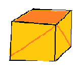

# Programowanie II - Lab 2

**Legenda**

📖 - proszę przeczytać

📝 - warte zapamiętania / zanotowania

⚠️ - zwróć uwagę

✏️ - zadanie do wykonania

🔍 - poszukaj w internecie

## Wprowadzenie
Klasa to zdefiniowany zbiór atrybutów i funkcji (metod). Nowy obiekt stworzony z danej klasy nazywamy **instancją**. Interakcja z pozostałymi obiektami odbywa się przez wcześniej zdefiniowane metody.

### minimalna definicja klasy
Aby zdefiniować klasę należy użyć słowa kluczowego `class`, dowolną nazwę (najlepiej zaczynającą się z dużej litery) oraz dwukropek.
```python
class Nazwa:
    pass
```

Słowo kluczowe `pass` odgrywa tutaj kluczową rolę, w Pythonie nie ma możliwości pozostawienia pustej definicji klasy/funkcji oraz bloku instrukcji sterowania.

### Tworzenie instacji z klasy

przykład:
```python
# Definicja klasy
class Person:
    name = None

# Tworzenie nowego obiektu (nowej instancji)
p1 = Person()
p2 = Person()

# Przypisanie wartości do zmiennej name dla obiektu p1
p1.name = 'Jordan'

# Przypisanie wartości do zmiennej name dla obiektu p2
p2.name = 'Kevin'

print(f"{p1.name}, {p2.name}")
```

### Konstruktor
Bardzo ważnym elementem tworzenia klasy jest konstruktor. Konstruktor jest to metoda `__init__` która definiuje jakie parametry przyjmuje nasza klasa. 
Metoda `__init__` (oraz większość metod definiowanych w klasie) zawsze powinna posiadać przynajmniej jeden argument `self`, umieszczony na początku listy arugmentów.

Argument `self` odnosi się do konkretnej instancji obiektu, poprzez `self` uzyskujemy dostęp do zmiennych i innych metod danej klasy.

przykład:
```python
# Definicja klasy
class Person:
    name = None
    def __init__(self, name):
        self.name = name
    

# Tworzenie nowego obiektu (nowej instancji)
p1 = Person('Jordan')
p2 = Person('Kevin')

print(f"{p1.name}, {p2.name}")
```


#### Definiowanie metod klasy

Przykład:
```python
# Definicja klasy
class Student:
    name = None
    gpa = 0.0
    def introduce(self):
        print(f"Hello! My name is {self.name} and my GPA is {self.gpa}/4.0 .")

# Tworzenie nowego obiektu
s1 = Student()
# Przypisanie wartości dla zmiennej name "znajdującej się" w obiekcie s1
s1.name = 'Paul'
s1.gpa = 5
# Wywołanie funkcji (metody) obiektu s1
s1.introduce()
```


przykład:
```python
# Definicja klasy
class Person:
    name = None
    def __init__(self, name):
        self.name = name
    
    def change_name(self, new_name):
        self.name = new_name
        
    def print_name(self):
        print(f"My name is {self.name}")
        
    def __str__(self):
        return self.name
    

# Tworzenie nowego obiektu (nowej instancji)
p1 = Person('Jordan')
p2 = Person('Kevin')

p2.print_name()

p1.change_name('Kenny')

print(f"{p1}, {p2}")
```

## Zadania

### Zadanie 1


Zaimplementuj klasę w Pythonie zgodnie z ustaleniami z poprzednich zajęć:


* Kosmita powinien posiadać zmienną `name` do przechowywania jego imienia.
* Kosmita powinien posiadać zmienną `age` do przechowywania jego wieku.
* Kosmita powinien posiadać zmienną `planet` do przechowywania numeru planety na której żyje (licząc od słońca).

### Zadanie 2

Zaimplementuj klasę w Pythonie zgodnie z ustaleniami z poprzednich zajęć:


* Rakieta powinna posiadać zmienną `mass`.
* Rakieta powinna posiadać zmienną `fuel`.
* Rakieta powinna definiować funkcję która policzy ile paliwa zostanie zużyte aby wzbić się na wysokość `h`.

### Zadanie 3

Zaimplementuj klasę w Pythonie zgodnie z ustaleniami z poprzednich zajęć:



* Pudełko powinno posiadać zmienną `size` do przechowywania jego rozmiaru (w formie krotki: LENGTH, WIDTH, HEIGHT).
* Ilość obiektów przechowywana przez pudełko, powinna być ograniczona przez jego rozmiar (zmienna `size`). 


### 🌟 Zadanie 4

Utwórz klasę `CrazyStrings` która będzie udostęniać następujące metody:
* `__init__` z parametrem `text`.
* `leet` która wyświetli tekst w stylu Leet. (https://pl.wikipedia.org/wiki/Leet_speak).
* `poke` który wyświetli tekst naprzemiennie zmieniając litery na małe i duże. 
* `random` która wyświetli tekst w losowym stylu (dwóch powyższych).
*  Dodaj własny styl.

