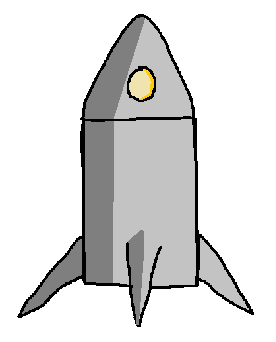

# Programowanie II - Lab 2

**Legenda**

 📖 - proszę przeczytać

 📝 - warte zapamiętania / zanotowania

⚠️ - zwróć uwagę

✏️ - zadanie do wykonania

 🔍 - poszukaj w internecie

## Wprowadzenie
Klasa to zdefiniowany zbiór atrybutów i funkcji (metod).

### Tworzenie obiektów z klasy

```python
# Definicja klasy
class Person:
    name = None

# Tworzenie nowego obiektu
p1 = Person()
p2 = Person()

# Przypisanie wartości do zmiennej name dla obiektu p1
p1.name = 'Jordan'

# Przypisanie wartości do zmiennej name dla obiektu p2
p2.name = 'Kevin'

print(f"{p1.name}, {p2.name}")
```

```python
# Definicja klasy
class Student:
    name = None
    def introduce(self):
        print(f"Hello! My name is {self.name}.")

# Tworzenie nowego obiektu
s1 = Student()
# Przypisanie wartości dla zmiennej name "znajdującej się" w obiekcie s1
s1.name = 'Gorgio'
# Wywołanie funkcji (metody) obiektu s1
s1.introduce()
```

## Zadania

### Zadanie 1

Zaimplementuj obiekt w Pythonie zgodnie z ustaleniami z poprzednich zajęć:


* Pudełko powinno posiadać zmienną `size` do przechowywania jego rozmiaru (w formie krotki: LENGTH, WIDTH, HEIGHT).
* Ilość obiektów przechowywana przez pudełko, powinna być ograniczona przez jego rozmiar (zmienna `size`). 

### Zadanie 2

Zaimplementuj obiekt w Pythonie zgodnie z ustaleniami z poprzednich zajęć:


* Kosmita powinien posiadać zmienną `name` do przechowywania jego imienia.
* Kosmita powinien posiadać zmienną `age` do przechowywania jego wieku.
* Kosmita powinien posiadać zmienną `planet` do przechowywania numeru planety na której żyje (licząc od słońca).

### Zadanie 3

Zaimplementuj obiekt w Pythonie zgodnie z ustaleniami z poprzednich zajęć:



* Rakieta powinna posiadać zmienną `mass`.
* Rakieta powinna posiadać zmienną `fuel`.
* Rakieta powinna definiować funkcję która policzy ile paliwa zostanie zużyte aby wzbić się na wysokość `h`.


